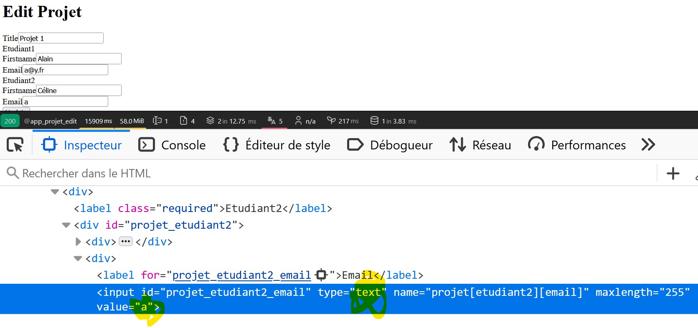
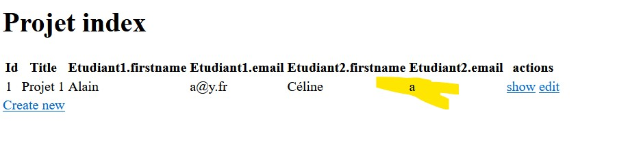

# PHP 

```txt
PHP 8.2.12 (cli) (built: Oct 24 2023 21:15:15) (ZTS Visual C++ 2019 x64)
Copyright (c) The PHP Group
Zend Engine v4.2.12, Copyright (c) Zend Technologies
    with Xdebug v3.3.1, Copyright (c) 2002-2023, by Derick Rethans
```


# installation 

```sh
symfony new symfony-vo-assert --webapp --version=6.4
```

# Base de données SQLITE

-> voir fichier .env

# voila le problème

J'ai suivi et adapté ton tuto qui est vraiment EXCELLENT !! 

Dans `App\Entity\ValueObject\Etudiant.php` 

1. j'ai bien ajouté `#[Assert\Email()] ` sur la propriété `$email` 
2. mais lorsque je soumets le formulaire :
    - `https://127.0.0.1:8000/new`
    - en modifiant le html via la console du navigateur pour vérifier que la validation est bien exécuter :
    - `<input type="email">` par `<input type="text">`
    - voir impression 




3. ça passe ???? comme si la validation était ignorée

